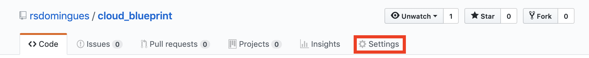
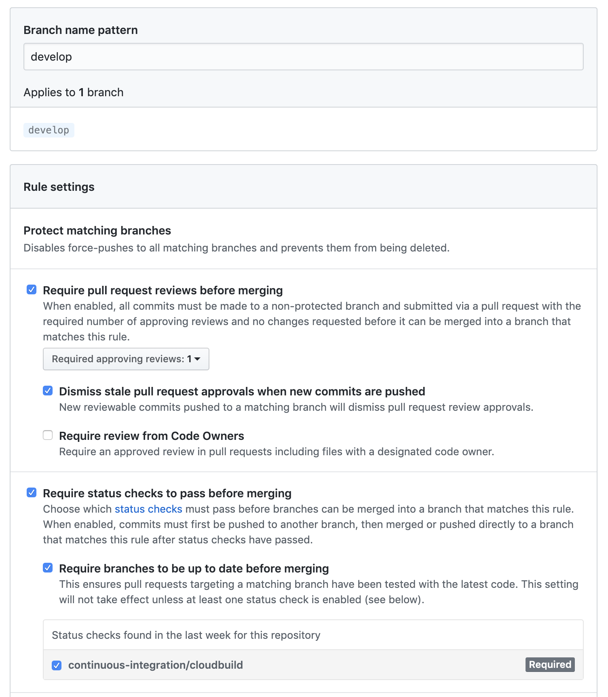
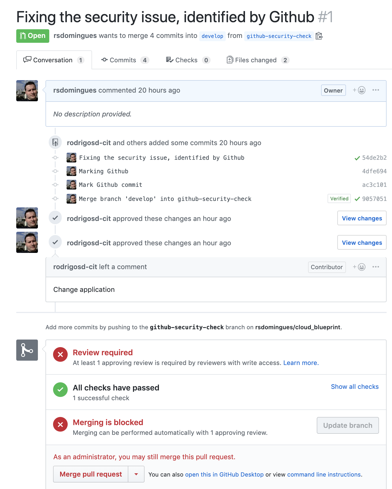
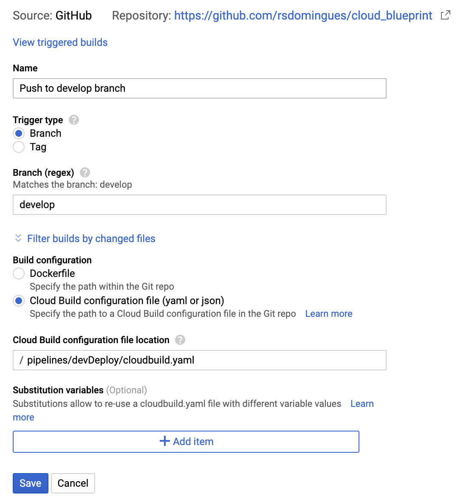

# Building the blueprint step by step


We are going to take you step by step to build this blueprint on your own cloud environment. The flow we are implementing is:


### (Step 1) Creating your source code repository 
---

If you don't already know github this quick [guide](https://guides.github.com/activities/hello-world/) will help you create your first repository. If your not familiar with the Gitflow process, we reccomend that you get to know it first.
 
To enforce the policies we are going to create github offers a feature to secure the branchs, we will use this to ensure that every commit to the developer and master branchs are checked commits (checked by the CI to ensure coverage, vulnarabilities, code standards, style etc.). We are also going to use the pull request as a code review feature by requesting at least one approved review for the approval of the pull request.

To configure this options just go to the settings page of your github repositury:


Then in the options branch, select the add 2 new rules and configure this options:
 - branch name patter (rule 1: `master`, rule: 2: `develop`)
 - **Require pull request reviews before merging**, then configure the amout of aprovers and if you need the code owner aproval. In our case we require just one aproval and it not need to be the code owner, beacause that cover more than 80% of the problem and give the development team the independency to define it's own aproach to code review, if its a peer review or the most senior member should executed it.
 - **Require status checks to pass before merging**, check the `Require branches to be up to date before merging` and the `continuous-integration/cloudbuild` if it is available. This last option will only be available after we complet the step 2 and have a CI environment checking the work.

For reference this is our configuration:


With this configuration, whenever a new pull request is created it will only be available to aproved if the last commit is a checked one, and the code has at least one review. By default the admins of the repository has rights to override this rules, but you can configure it to enforce it to. Above is just an example of a pull requrest page:



### (Step 2) Unit testing and packaging the app
---
The sample application we are going to use is the [FooApp](https://github.com/rsdomingues/cloud_blueprint/tree/master/fooapp). Wich is a Java application that echoes anything that do not contain the word `bar`. The repo has a directory called app where the application code is. To build ensure that the code is compliance with our rules, we should create an CI job that on every commit check the unit testing, coverage and compliance. To do so we can easely use maven running on each developer machine:

```bash
mvn clean verify
```

In the day to day work, is hard for developers use this details, so we can enforce than with a Google Cloud Build trigger for all commits. In that way the developers can follow their own process and we still can ensure the quality gateways. Also a good CI environment gives the developer a fast feedback for his work. A good practice is to run a build on every commit made to the source code. To achive that in an on-premisse environment is challengin due to the exponential number of builds, but in a cloud environment that is not hard at all. You just have to create an [Google Cloud Trigger](https://cloud.google.com/cloud-build/docs/running-builds/automate-builds) that connects your Github Repository to Google Cloud build.

**Create a trigger**:

Just got to the [Cloud Build](https://console.cloud.google.com/cloud-build/triggers) page at the GCP console and create a new trigger like in this example:


Now we can create the cloudbuild.yaml for this CI buiild, it has 2 steps, one is the build process and if that is ok, lets mark the commit in the Github repository using the Github API. You will find the code bellow on the /pipelines/onCommit directory of this repository.

```yaml
#Ensure companys policies for the code
steps:

#Ensure tests and coverage on every commit
- name: 'gcr.io/cloud-builders/mvn:3.5.0-jdk-8'
  args: ['verify', 'package', '-q']
  dir: 'fooapp/app'

#Run the github a build check
- name: 'gcr.io/cloud-builders/curl'
  args: ['-u', 'rsdomingues:$_GITHUB_TOKEN', '-X', 'POST', '-d', '{"state": "success","target_url": "https://console.cloud.google.com/cloud-build/builds/$BUILD_ID","description": "The build succeeded!","context": "continuous-integration/cloudbuild"}', 'https://api.github.com/repos/rsdomingues/cloud_blueprint/statuses/$COMMIT_SHA']
  dir:

#For easy filter
tags:
  - "onCommitBuild"
```

```bash
# To build the application from your console use
gcloud builds submit --config app/cloudbuild.yaml --substitutions=_GITHUB_TOKEN="<your git token>" .
```
### (Step 3) Testing performance and business 
---

As the work progress the development team will reach a state where the feature is ready for a validation from users or shared it with other team members for broad test. So he will open a pull reuqest to the **develop** branch from his **feature branch**. And then we will via Github process, ensure that the branch is up to date, the last comit of the **feature brach* is in the company standards and somone else revised the code. With that we can aprove the code review and merge the code.

Now we need to ensure that the whole component (microservice) is OK, and the business cases that it provide are still up and running with the required performance. To do that we need to run the component and performance testing with the application running.

In order to run the component and performance testing on the application, we need to run the component on a controled enviroment, with the container power we can do just that.

Lets create a docker-compose that contais the application and also its dependencies if needed so that we can boot up a environment just for this operation.

```yaml
version: '2'
services:
  # Dependencies if any


  # FooApp Application
  application:
    #cannot be build for it to work
    image: "gcr.io/${PROJECT_ID}/fooapp:${SHORT_SHA}"
    #application name is very importante for the test
    container_name: application
    networks:
      - cloudbuild
    ports:
      - "8080:8080"
    environment:
      - "SERVER_PORT:8080"

# Connect to the existing cloudbuild network
networks:
  cloudbuild:
    external: true
```

Just create you docker file using the image not a build and connect it to the cloudbuild network, you also need to give your container a name that will be used for the testing. 

**Note**: One important detail is to conect the package we just build using docker to the code version, so if needed we can correctly debug issues. A simple way of achiving that is using the `small sha` as the tag version of the docker image.


With the test environment ready we can configure another [Google Cloud Build Trigger](https://console.cloud.google.com/cloud-build/triggers) to build execute a more complete steps for the commits on the develop branch:



Lets create our cloudbuild.yaml file so that it adds the new steps:
 - Check the companies patter, just in case.
 - Build the docker image
 - Boot up our test environment with docker-compose
 - Wait for the application to boot (limited resource env)
 - Run the component testing using cucumber
 - Run the performance testing using gatling
 - Submit the images

```yaml
#Build the application and the package it a docker iamge
steps:

#0 ensure the tests are running before packgint the application
- name: 'gcr.io/cloud-builders/mvn:3.5.0-jdk-8'
  args: ['verify', 'package', '-q']
  dir: 'fooapp/app'

#1 create a docker container for the application
- name: 'gcr.io/cloud-builders/docker'
  args: ['build', '--tag=gcr.io/$PROJECT_ID/fooapp:$SHORT_SHA', '.']
  dir: 'fooapp/app'

#2 run the testing environment
- name: 'docker/compose:1.15.0'
  args: ['up', '-d']
  dir: 'fooapp/component-test'
  env:
    - 'PROJECT_ID=$PROJECT_ID'
    - 'SHORT_SHA=$SHORT_SHA'

#3 wait for the application to start
- name: 'gcr.io/cloud-builders/gcloud'
  entrypoint: '/bin/bash'
  args: ['-c', 'sleep 50']
  dir: 'fooapp/component-test'

#4 check if the application has started
- name: 'gcr.io/cloud-builders/gcloud'
  entrypoint: '/bin/bash'
  args: ['-c', './checkApp.sh']
  dir: 'pipelines/devDeploy'

#5 run the business and performance tests
- name: 'gcr.io/cloud-builders/mvn:3.5.0-jdk-8'
  args: ['verify', 'gatling:execute', '-q']
  dir: 'fooapp/component-test'

#6 saves it in the google registry
- name: 'gcr.io/cloud-builders/docker'
  args: ["push", "gcr.io/$PROJECT_ID/fooapp:$SHORT_SHA"]

#For easy filter
tags:
  - "devDeploy"
```

### Automaticly deploy to the developer environment (Step 4)
---

Now that we have a tested version of the application we can deploy it to the developer environment. In order to do that we need to create an environment first, just check the `Creating one environment` at end of this document to boot up yor env.

To deploy to GKE with kubectl, call the kubectl build step to update a Deployment resource:

 - Enable the GKE API.
 - Add GKE IAM role:
   - In GCP Console, visit the IAM menu.
   - From the list of service accounts, click the Roles drop-down menu beside the Cloud Build [YOUR-PROJECT-NUMBER]@cloudbuild.gserviceaccount.com service account.
   - Click Kubernetes Engine, then click Kubernetes Engine Admin.
   - Click Save.

In our case the developer environment is called `fooclusterdev`, to do the deployment lets just add another step on our develop build.

```yaml
[...]

#7 deploy the application to the environment
- name: 'gcr.io/cloud-builders/kubectl'
  args:
    - 'set'
    - 'image'
    - 'deployment'
    - 'fooapp-dev'
    - 'fooapp-dev=gcr.io/$PROJECT_ID/fooapp:$SHORT_SHA'
  env:
    - 'CLOUDSDK_COMPUTE_ZONE=us-west1-a'
    - 'CLOUDSDK_CONTAINER_CLUSTER=fooclusterdev'

#For easy filter
tags:
  - "devDeploy"
```

**Notes:** 
 - One thing to notice is that the version of image tag, is the commit from the GIT REPOSITORY, with that we are able to always keep track of witch code is deployed in each environment.
 - The propertie `SHORT_SHA` is only set for the SCM trugger build. To trigger it manually just run the following 

```bash
gcloud builds submit --config app/cloudbuild.yaml --substitutions=ENV_VAR="<VALUE>" .
```

### (setp 5 & 6) Deploying the application to other environments including production
---
**TODO**

##Creating one environment
---
Let's start by creating our K8S cluster called `foocluster` on GKE. On you Google Cloud Shell:

```bash
# Set your current prefered COMPUTE_ZONE for instance us-west1-a
gcloud config set compute/zone [COMPUTE_ZONE]

# Create the foocluster with defalt parameters
gcloud container clusters create foocluster
```

***Testing the environment (optional)***

Creating the Deployment
To run hello-app in your cluster, run the following command:

```bash
kubectl run hello-server --image gcr.io/google-samples/hello-app:1.0 --port 8080
```
This Kubernetes command, kubectl run, creates a new Deployment named hello-server. The Deployment's Pod runs the hello-app image in its container.

In this command:

- `image` specifies a container image to deploy. In this case, the command pulls the example image from a Google Container Registry bucket, gcr.io/google-samples/hello-app. :1.0 indicates the specific image version to pull. If a version is not specified, the latest version is used.
- `port` specifies the port that the container exposes.

To expose your application, run the following kubectl expose command:

```bash
kubectl expose deployment hello-server --type LoadBalancer \
  --port 80 --target-port 8080
```

Inspect the hello-server Service by running kubectl get:
```bash
kubectl get service hello-server

#Access the service by using http://[EXTERNAL_IP]/
```

**Clean up**
To avoid incurring charges to your GCP account for the resources used in this sample:

Delete the application's Service by running kubectl delete:

```bash
#This will delete the Compute Engine load balancer that you created when you exposed the deployment.
kubectl delete service hello-server


#Delete your cluster by running gcloud container clusters delete:
gcloud container clusters delete foocluster
```