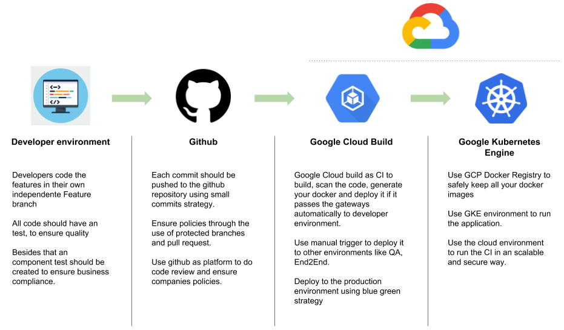
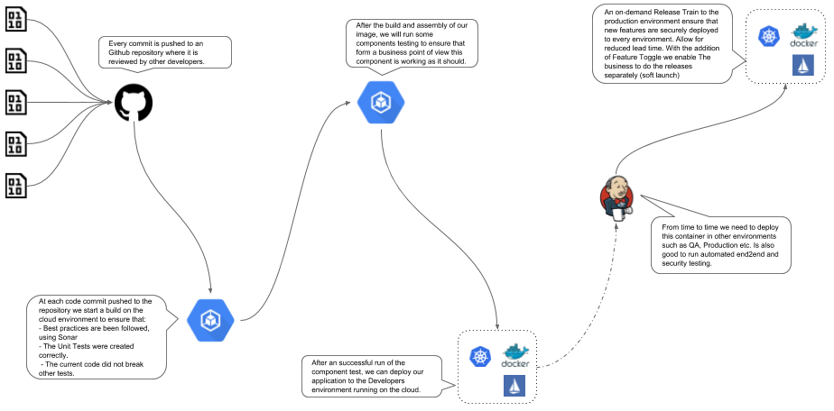
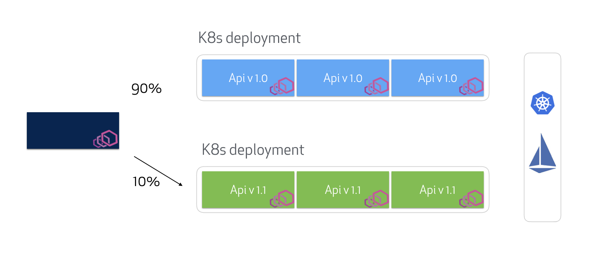

# Github Google Cloud Blueprint for FinServ
A FinServ microservice DevOps blueprint to kickstart a successful software development workflow on Google Cloud Plataform and Github

This repository contains instructions for implanting our opinioneted DevOps workflow on GCP to facilitate the creation of microservices solutions, that are compliance to industry standards and regulations and still provide the development team a fast and realiable environment.

This blueprint helps you visualize what a modern development workflow looks like and how it could be implemented in organizations at scale,using a baseline definition that can be expanded as needed depending on specific requirements.

# Blueprint Description

In general lines, we are going to build a development flow that enables developers to have fast feedback from their work, and how it impacted the software component during a feature development. When a feature is in a good enought state the work can be integrated to the aplication. The good enought will be verified via pull request with automatic checks and code review. When it is integraded to the aplication a new set of quality gateways will be applied and then automaticly deployed to a development environmenrt for testing propouses. After validating it can be delployed to other environments in an automated matter, in conjunction to a blue/green deployment strategy that ensure low risk deployments.  

The following diagram shows the main responsabilitys, we will explore in more details each phase and step of the process.

This flow is designed to allows collaborators to leverage an agile workflow while tracking all work items for regulatory purposes. The tight integration offered by the GKE solution simplifies the deployment and operations of a Kubernetes based “service mesh” and enables teams to dynamically scale the application infrastructure with confidence and agility. All covered with an DevOps Flow that enable security and speed.

## Techinical details
---
Now let's explore each step of the process in details:

**The application** 

For this DevOps workflow we need an sample app, for this we are going to use the [FooApp](https://github.com/rsdomingues/cloud_blueprint/tree/master/fooapp), wich is an simple cloud native java application build on top of the [Spring Cloud Framework](https://spring.io/projects/spring-cloud). Feel free to explore it, because it has some example of automated testing, clean architecture and some other stuff.

**Development process**
To give our developer the ability to focus on the application managment part we are going to build a fully automated pipeline that will take our code to produciton. For compliance and security we are going to insert "control gates" on the pipeline for our binaries, so that we can ensure that the "builded and tested" aplication is deployed sucessully in risk free way to the production environment.

**Source Control Managment**

One big importante element to the teams productivity is the SCM process, to enable fast and secure development. Nowadays there are two main aproachs used by most companies, Gitflow and Trunk Based Development (TDB). While TDB provide a much faster aproach, for most teams it is dificult do adopt it, due to culture changes involved in the way of work. Also due to security reasons most finserv companies need to keep a closer track of what is happening on their source code and who is checking and aproving the chages.

All things considered, this blueprint make use of the Gitflow aproach, but we highly recommend working with a reduced model of branchs and planning on the changes needed for the trunk based aproach, because of the speed and conection it provides between development and production.

**Project Managment**

For project managment we are going to use Jira, so that we can control the issues and tickers for the entire development process not only for development issues.

**Packaging and Deploy**

For the infrasctructures needs to create and configure the GCP environment (or in fact any other cloud provider) we highlly recomend the use of an Infrastructure as a service (such as terraform). 

For the application packaging, our belive is that modern application should use Containers, they provide a real world proved way of paring production and development, reducing issues with snowflake enviroments. Beside that most cloud providers have some sort of Platform as a Service for containers witch gives you a good way of simplifing you production enviroment.

Containers are also a way of bridging the gap between development and operation, giving developers an open and realiable way to use a higher amout of tecnologies and still given operation a simple way to manage every thing.

**Running Environments**

In that matter GCP is verry well positioned with the Google Kubernets Engine (GKE). That provide a fully managed kubernets enviroment. Another diferentiator of the GCP is that you can use [GKE on-prem](https://cloud.google.com/gke-on-prem/) or even better [Anthos](https://cloud.google.com/anthos/) to achive a hybrid cloud and keep you production environment inside the house for regulatory propouse.

In this blueprint we will explore only the cloud GKE environment to execute deployment, but it can be easyly adjust for [GKE on-prem](https://cloud.google.com/gke-on-prem/) or [Anthos](https://cloud.google.com/anthos/) usecases.

### Deployment strategy

Blue/Green deployment strategy using Google Cloud targeting a polyglot application deployed to an GKE Cluster. Istio is used to shape traffic to different versions of the same microservice giving full control on what your users see and controlling the flow of releases throughout the pipeline.

### Who created this blueprint 

CI&T is a global digital technology solutions partner, that can help you achive your digital transformation through business, tecnology and people. A pioneer in design thinking, lean digital transformation, and advanced technologies. For over 20 years, CI&T has been a trusted partner of industry leading brands. 

This bluprint was created by our spetialist team to help you on your digital solutions path.

If you like it, or want to know more, contact us: https://us.ciandt.com/
 

### Useful links
---
- [CI&T Website](https://us.ciandt.com/)
- [Google Cloud Build](https://cloud.google.com/cloud-build/)
- [Google Kubernets Engine](https://cloud.google.com/kubernetes-engine/)
- [Istio](http://istio.io)
